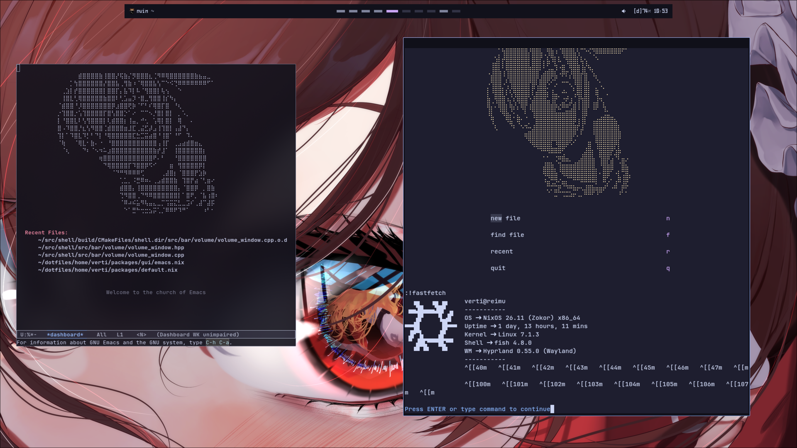

# dotfiles
warcrimes against the nix community



---

This repository contains my personal nixos configs (please don't actually try to use it).

It follows the basic structure of:
```
.
├── home    - the config stuff
├── hosts   - per-host configs
├── lib     - helper function (s in the future maybe)
└── modules - reusable modules
```

glory to keep-sorted

---
